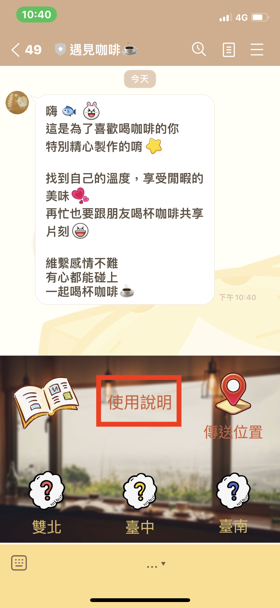
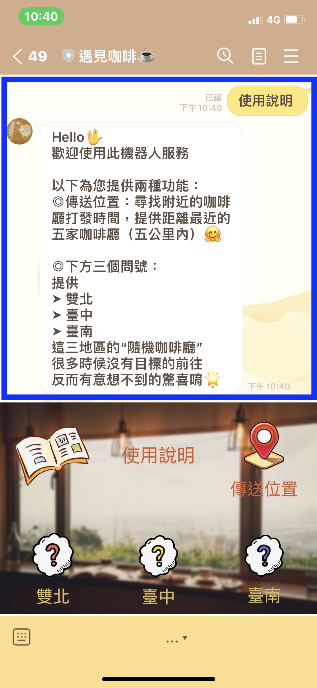
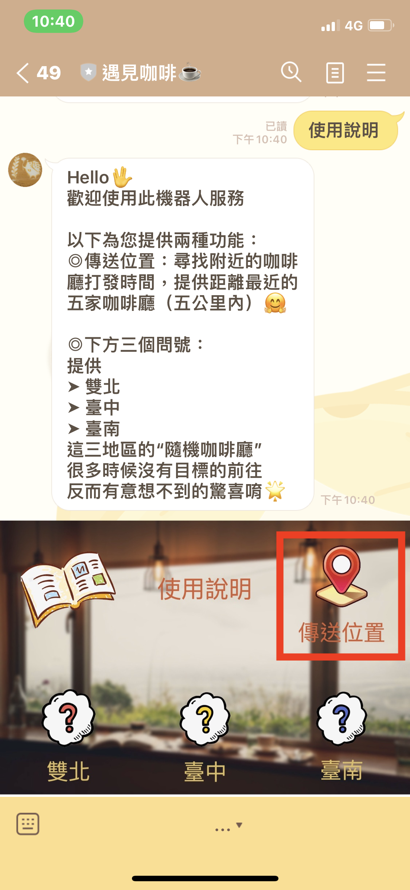
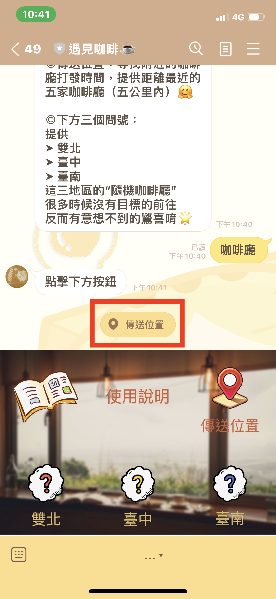
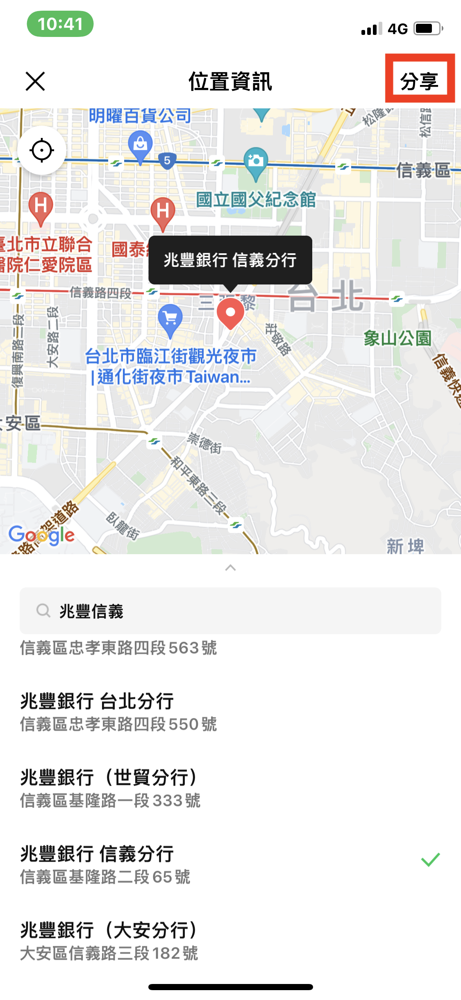
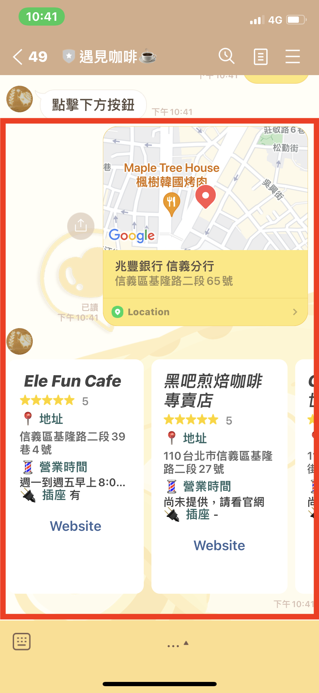
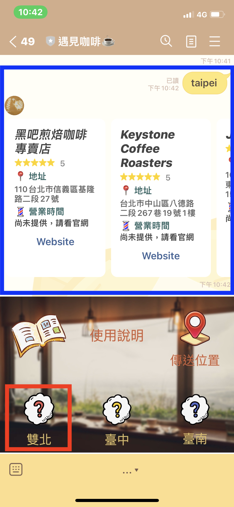
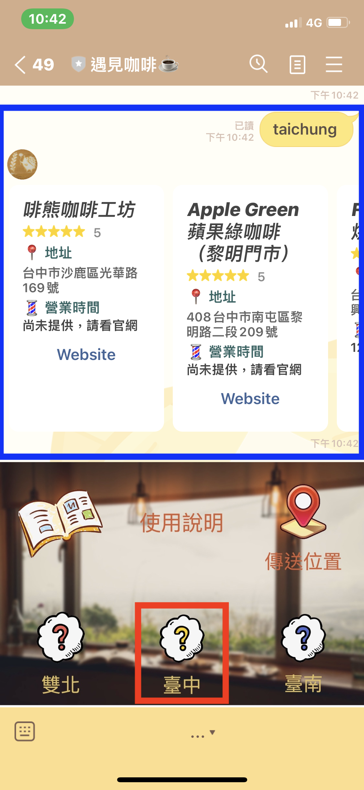
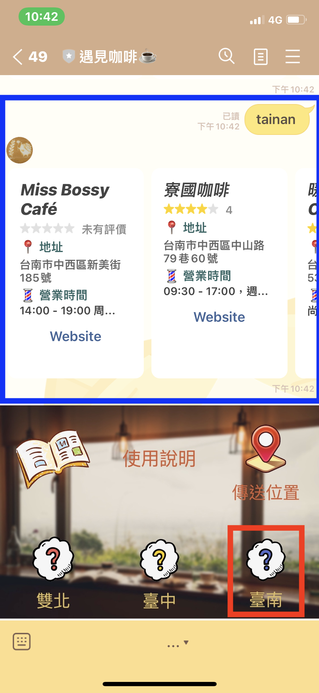

# 遇見咖啡 ☕ &nbsp;&nbsp; Line機器人
在塵囂中度過每日的虛華， 
是否已忘記了生活的本質？ 
 
不知有多久沒跟朋友一起喝杯咖啡？ 
又或者有多久沒享受一個人的時光？ 
又或是能遇到好久不見的人出現在街角的咖啡店  
不論是打發時間或是維繫感情都是最好的選擇！ 

## 導覽
*  <a href="#friend">加入好友</a>
*  使用介紹
*  API資料來源

## 加入好友
*  透過 ID： @756jfgsd
 
 
*  點擊：

 
 
*  掃描 QR Code：
 
 

## 使用介紹
1. 點選“使用說明”
 

 
 
2. 傳送位置，可回傳距離最近的五家咖啡廳

 
 
3. 點地區隨機選項，可回傳該地區隨機的八家咖啡廳
 
 
點選“雙北”
 

 
 
點選“臺中”
 

 
 
點選“臺南”
 

## API 資料來源
[Cafe Nomad](https://cafenomad.tw/developers/docs/v1.2)